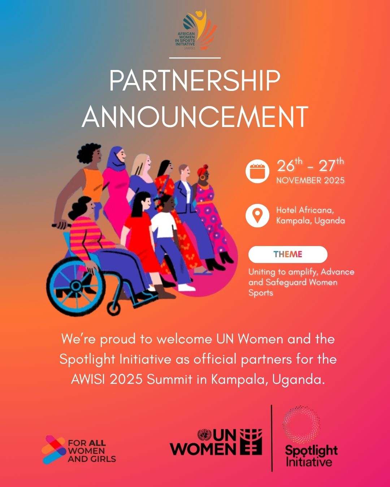

# 🎨 Design Portfolio – Aslam Mpaata

This repository showcases a collection of my graphic design and digital media work, created for organizations, events, and digital campaigns.

## 📌 About Me
I am a Computer Science (AI) student with experience in both software development and digital media. My design work focuses on creating engaging visuals that support storytelling, branding, and community impact.

## 🧩 Categories

### 📢 Posters
- Event posters and promotional graphics
- Sports and community campaigns

## 📢 Sample Work

### 📱 Social Media Content
- Instagram and digital campaign designs
- Engagement-focused visual content

### 🎨 Branding
- Logo designs and visual identity work

## 🛠 Tools Used
- Canva
- Adobe Premiere Pro
- After Effects
- CapCut

## 🌍 Related Work
- AWISI Website: https://africanwomeninsports.org/

## 📬 Contact
- LinkedIn: https://www.linkedin.com/in/aslammpaata
